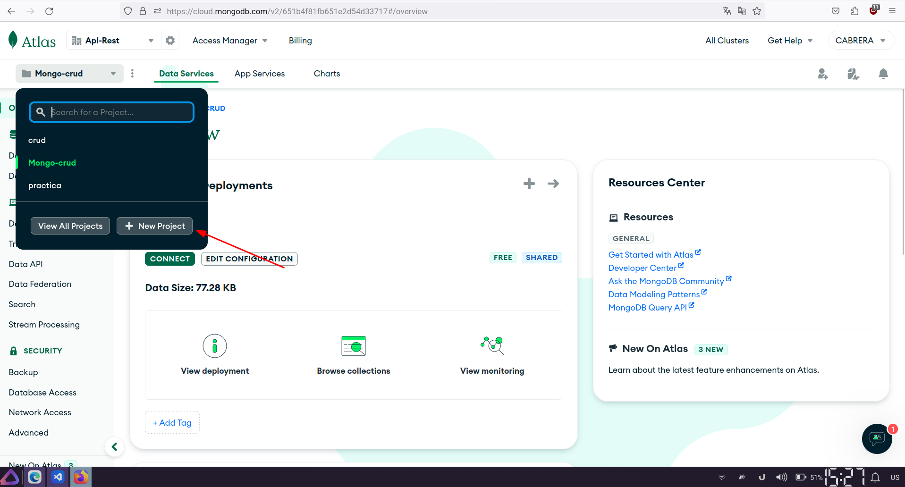
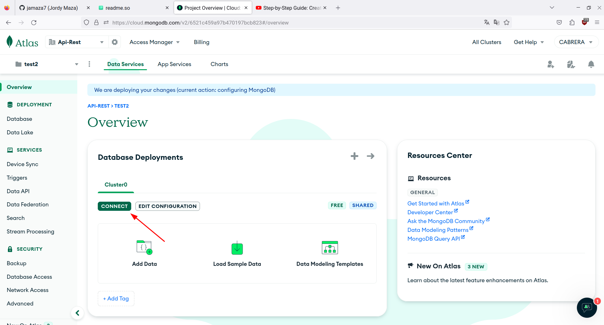
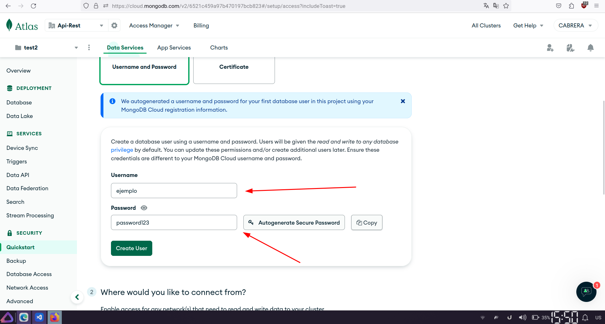
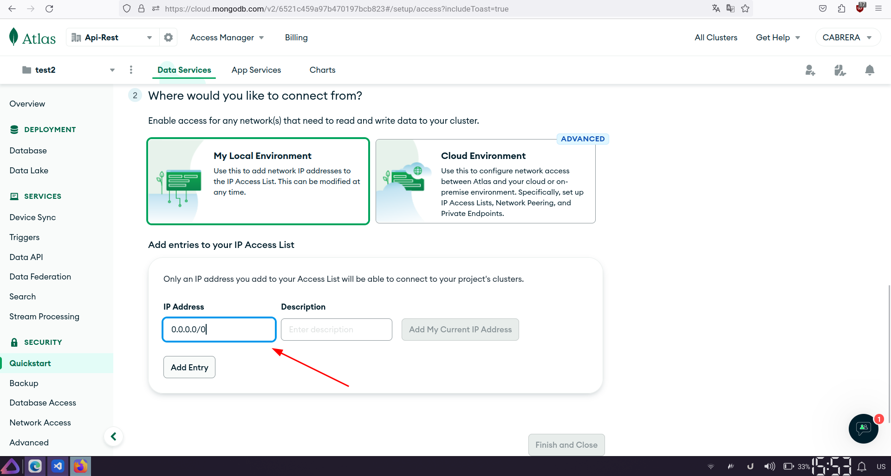
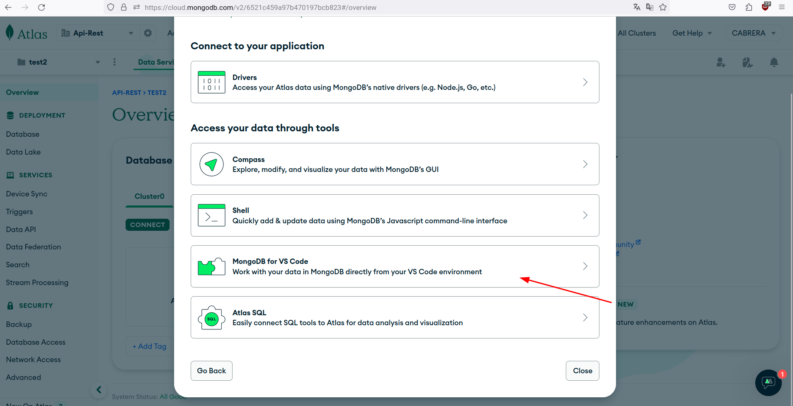
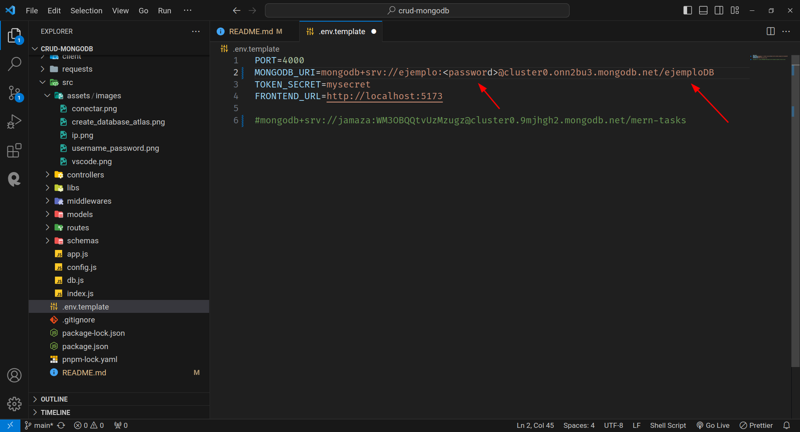
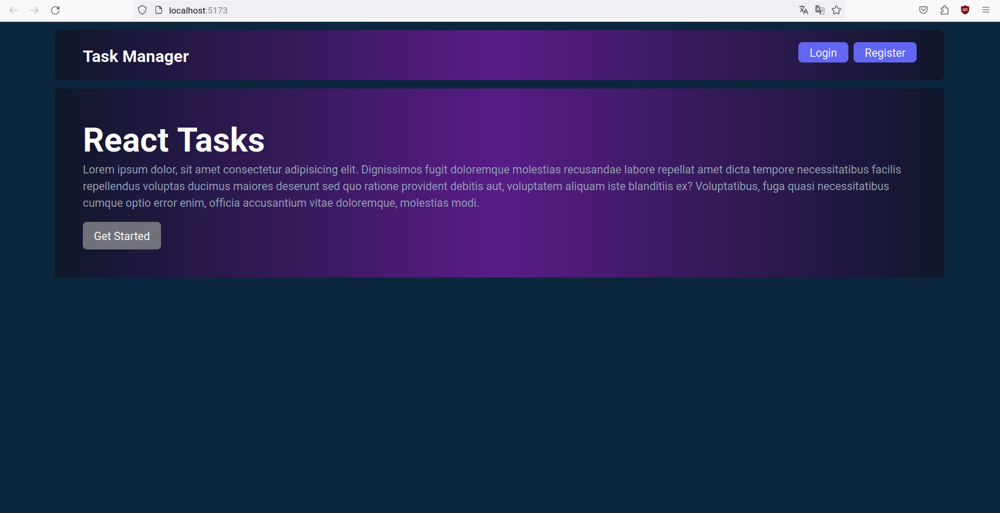
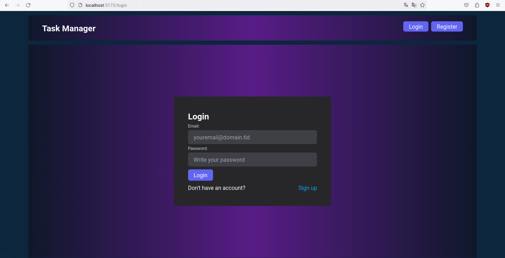

### CRUD con MONGODB

Un sencillo sistema CRUD con React, Nextjs y MongoDB 🚀

## Authores

- [@Jordy Maza](https://github.com/jamaza7)
- [@David Culqui](https://www.github.com/)

## Tabla de Contenidos

- [Instalación](#instalación)
- [Configuracion](#configuración)
  - [Ejemplos](#ejemplos)
- [Capturas](#capturas)
- [Créditos](#créditos)
- [Licencia](#licencia)

## Instalación

Clonar el proyecto

```bash
  git clone https://github.com/jamaza7/crud-mongodb.git

```

Instalacion del proyecto via npm

```bash
  cd crud-mongodb
  npm install

```

## Configuración

Para configurar la conexión a la base de datos MongoDB asegurese de tener una cuenta en
[MongoDB Atlas](https://www.mongodb.com/atlas/database) , siga estos pasos:

1. Despues de crear una cuenta en mongodb atlas, debera crear un nuevo proyecto

   

2. Siguiente paso se procede a conectar la base de datos



3. Se crea un usuario, contraseña y ip de la base de datos





4. Se procede a conectar la base de datos con la herramienta vscode, se le genera un link debera copiarlo 

5. En el archivo `.env.example` configure las variables de entorno, debera pegar la cadena de conexion que se le genero:

   ```env
   // env.example
    PORT=4000
    MONGODB_URI=mongodb+srv://ejemplo:<password>@cluster0.onn2bu3.mongodb.net/ejemploDB
    TOKEN_SECRET=mysecret
    FRONTEND_URL=http://localhost:5173

     // Otras opciones de configuración
   ;
   ```

6. Le deberia quedar asi



### Ejemplos

Para ejecutar el proyecto en el lado del servidor debera ejecutar el comando

```bash
    npm run dev

```

Para ejecutar el proyecto en el lado del cliente debera navegar hasta la carpeta `client`

```bash
    cd client
    npm run dev

```

## Capturas

Al ejecutar se le presentara lo siguiente




## Créditos

Agradecimientos al **Mgs. Mauro Rosas** Lara por los conocimientos impartidos

## Licencia

Este proyecto está bajo la Licencia Estudiantil del Instituto Japon.
